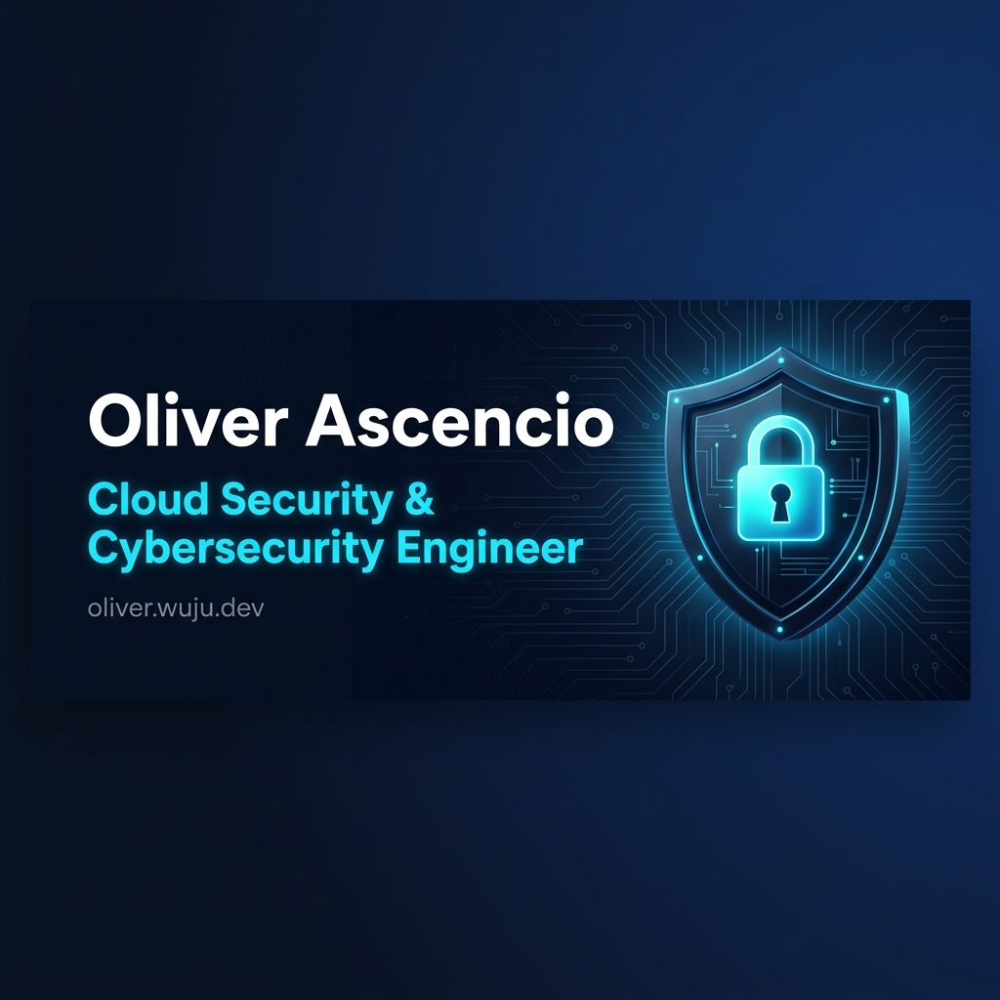

<!-- BANNER -->

  

<!-- BADGES -->

  
  
  
  

---

## Hey, I'm Oliver! 🛡️

- 🔐 **Cloud Security & Cybersecurity Engineer** — Zero Trust, IAM, hardening, threat modeling
- 🚀 **Cofundador & Líder Técnico @** [**Wuju**](https://oliver.wuju.dev) — Dirección de arquitectura e infraestructura para clientes reales
- 🎓 **Ingeniería en Desarrollo de Software** (UNICAES) · **TSU Ciberseguridad** (ESIT/MINED – avalado por INFOTEC MX)
- 🌎 Abierto a oportunidades remotas en **Ciberseguridad, SOC, Cloud Security & DevSecOps**

---

## 🛠️ Tech Stack

  
  
  
  
  
  
  
  
  
  
  
  
  
  
  
  

---

## 📊 GitHub Stats

  
  

 

  

 

  

 

<!-- SNAKE ANIMATION -->

  <picture>
    <source media="(prefers-color-scheme: dark)" srcset="https://raw.githubusercontent.com/javacachava/javacachava/output/github-contribution-grid-snake-dark.svg" />
    <source media="(prefers-color-scheme: light)" srcset="https://raw.githubusercontent.com/javacachava/javacachava/output/github-contribution-grid-snake.svg" />
    
  </picture>

---

## 📜 Certifications

  
  
  

---

  

  ⚡ Open to remote roles in <b>Cybersecurity · Cloud Security · SOC · DevSecOps</b> ⚡

